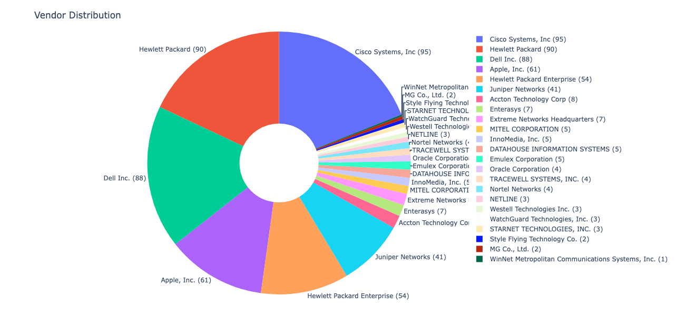
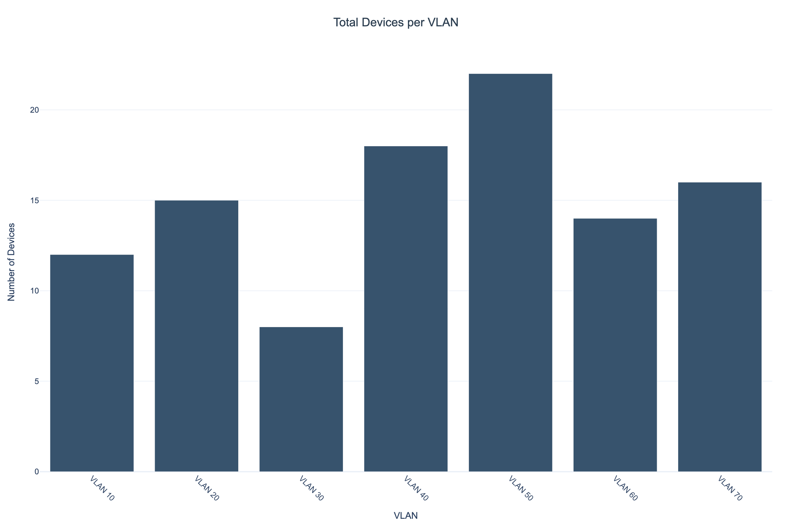
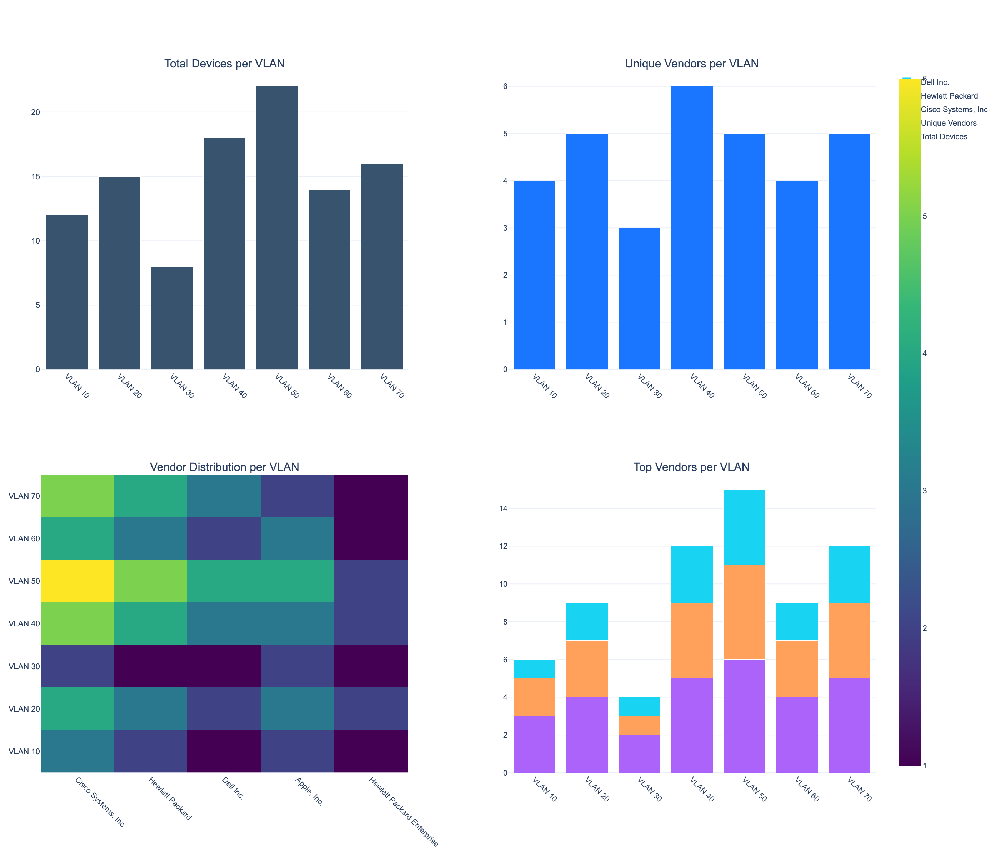

# 🚀 NetVendor


*NetVendor provides comprehensive network device analysis and visualization*

## 📖 Introduction

**NetVendor** is a Python tool for network administrators and cybersecurity professionals to analyze and visualize the vendor distribution of devices on a network. It processes MAC address tables and ARP data from a wide range of network devices (including Cisco, HP/Aruba, Juniper, Extreme, Brocade, and more), providing detailed insights into your network's composition.

---

## ✨ Features

- **Multi-vendor MAC address parsing:** Supports Cisco, HP/Aruba, Juniper, Extreme, Brocade, and more.
- **Flexible input:** Accepts MAC address lists, MAC tables, and ARP tables in various formats.
- **Vendor identification:** Uses a local IEEE OUI cache for fast, secure lookups.
- **Comprehensive reporting:** Generates CSVs, summaries, and interactive HTML dashboards.
- **VLAN and port analysis:** Extracts and visualizes VLAN and port data where available.
- **Extensible and robust:** Easily add support for new formats; thoroughly tested with real-world data.

---

## 🚀 Getting Started

### Prerequisites

- Python 3.6 or higher
- Required packages: `requests`, `plotly`, `rich`, `tqdm`
- Input file containing MAC addresses or ARP data from your network devices

### Installation

```bash
git clone https://github.com/StewAlexander-com/NetVendor.git
cd NetVendor
pip install -e .
```

---

## 📋 Usage

### Basic Command

There are two ways to run NetVendor:

**1. Package entry point (simple, no flags):**
```bash
netvendor input_file.txt
```
or
```bash
python3 -m netvendor input_file.txt
```

**2. Standalone script (full feature set with all flags):**
```bash
python3 NetVendor.py input_file.txt
```

**Note:** The standalone script (`NetVendor.py`) supports all advanced features including `--offline`, `--siem-export`, `--history-dir`, `--analyze-drift`, `--site`, `--environment`, and `--change-ticket` flags. The package entry point (`netvendor`) is a simple wrapper that only accepts an input file argument.

### Offline Mode (cache-only lookup)

Use the `--offline` flag with the standalone script when you want to avoid any external vendor lookups (for example, on air‑gapped networks).  
Devices that are not already present in the local OUI cache will appear as `Unknown`.

```bash
python3 NetVendor.py --offline input_file.txt
```

### Historical Drift Analysis (vendor trends over time)

When you run `NetVendor.py`, a human-readable `vendor_summary.txt` is always written to `output/`.  
If you want to track how vendor composition changes over time and correlate with change windows/incidents, you can:

- Automatically archive summaries with metadata and run drift analysis:

```bash
python3 NetVendor.py \
  --history-dir history \
  --site DC1 \
  --change-ticket CHG-12345 \
  --analyze-drift \
  input_file.txt
```

This will:
- Save the usual outputs under `output/` (CSVs, HTML dashboard, summary).
- Copy `output/vendor_summary.txt` to `history/vendor_summary-YYYYMMDD-HHMMSS.txt`.
- Create a companion `history/vendor_summary-YYYYMMDD-HHMMSS.metadata.json` file containing:
  - `run_timestamp`: UTC ISO-8601 timestamp of the run
  - `site`: Site/region identifier (from `--site` flag)
  - `change_ticket_id`: Change ticket/incident ID (from `--change-ticket` flag)
- Generate `history/vendor_drift.csv` with:
  - **Metadata rows** at the top: `run_timestamp`, `site`, `change_ticket_id` for each snapshot
  - **Vendor percentage rows**: One row per vendor showing percentage across all runs

**SIEM Correlation & Incident Analysis:**
The drift CSV metadata enables correlation with change windows and incidents in your SIEM, supporting 8D/5-why workflows. You can:
- Join drift data with SIEM events using `run_timestamp` and `site`
- Correlate vendor mix shifts with `change_ticket_id` to identify change-related impacts
- Track vendor distribution changes across multiple sites and time periods

### SIEM-Friendly Export (CSV/JSONL)

For SIEM integration (Elastic, Splunk, etc.), `NetVendor.py` can emit normalized CSV and JSONL events:

```bash
python3 NetVendor.py \
  --siem-export \
  --site DC1 \
  --environment prod \
  input_file.txt
```

This will add the following files under `output/`:

- `netvendor_siem.csv` (line-delimited CSV with header)
- `netvendor_siem.json` (JSONL format, one JSON object per line)

**Stable Schema** (all fields present in every record for reliable correlation):

Each event includes the following SIEM-friendly fields:

- `timestamp`: UTC ISO-8601 collection time (e.g., `2025-10-31T16:23:45Z`)
- `site`: Site/region identifier from `--site` flag (e.g., `DC1`, `HQ`, `us-east-1`)
- `environment`: Environment identifier from `--environment` flag (e.g., `prod`, `dev`, `staging`)
- `mac`: Normalized MAC address in standard format (`xx:xx:xx:xx:xx:xx`)
- `vendor`: Vendor name from OUI lookup (or `Unknown` if not found)
- `device_name`: Device identifier (derived from MAC as `device-xx-xx-xx-xx-xx-xx` if not explicitly provided)
- `vlan`: VLAN ID (or `N/A` if not available)
- `interface`: Network interface/port identifier (e.g., `Gi1/0/1`, `ge-0/0/0`)
- `input_type`: Source data type (`mac_list`, `mac_table`, `arp_table`, or `unknown`)
- `source_file`: Original input filename

**Correlation-friendly design:**
- All fields are consistently named and present in every record
- MAC addresses are normalized for reliable joins
- Timestamps are UTC ISO-8601 for time-based correlation
- Site and environment tags enable multi-site/environment dashboards

You can safely combine flags in a single run, for example:

```bash
python3 NetVendor.py \
  --offline \
  --history-dir history \
  --analyze-drift \
  --siem-export \
  --site DC1 \
  --environment prod \
  input_file.txt
```

In this case, the tool will:

- Run without external vendor lookups (`--offline`)
- Generate all standard outputs under `output/` (Device CSV, Port CSV, HTML dashboard, Vendor Summary)
- Archive `vendor_summary-YYYYMMDD-HHMMSS.txt` and its companion `.metadata.json` into `history/`
- Update `history/vendor_drift.csv` with the new snapshot (if `--analyze-drift` is used)
- Emit SIEM-ready `netvendor_siem.csv` and `netvendor_siem.json` tagged with `site=DC1` and `environment=prod`

### Windows Usage

```powershell
$env:PYTHONIOENCODING = "utf-8"
$env:PYTHONUTF8 = "1"
python3 -m netvendor input_file.txt
```

---

## ✅ Operational Best Practices

- **Prefer offline vendor lookups**: The OUI cache is seeded and persisted under `output/data/oui_cache.json`. Run once on representative data to warm the cache; subsequent runs avoid external requests and are faster.
- **Avoid parallel CLI runs**: OUI API lookups are rate-limited with backoff and service rotation. For batch processing, run files sequentially to prevent throttling.
- **Let the tool normalize MACs**: Inputs in colon, hyphen, dot, or mask/prefix forms are accepted; output is consistently `xx:xx:xx:xx:xx:xx`.
- **Large input handling**: Use unedited device outputs. The parser skips headers and tolerates mixed casing. Ensure `output/` is writable and on local storage for speed.
- **Port reports**: Generated only for MAC address tables (not ARP or simple lists).
- **Output hygiene**: Clean `output/` between runs in CI or keep it out of version control to avoid stale artifacts.
- **Windows encoding**: Use the environment variables above to prevent encoding issues with device outputs.
- **Security**: Treat MAC/ARP dumps as sensitive. Review `output/data/failed_lookups.json` before sharing artifacts.
- **Reproducibility**: Pin and install dependencies from this repo. Archive `output/data/oui_cache.json` with reports for future re-runs.

---

## ⚙️ Runtime Considerations

### Performance & Scalability

- **Memory usage**: All devices are loaded into memory as a dictionary. Typical runs with thousands of MACs use minimal memory (<100MB). Very large inputs (100K+ MACs) may require 500MB-1GB RAM.
- **Processing time**: 
  - Cached lookups: ~0.5-1 second per 1,000 MACs
  - With API lookups: ~2-5 seconds per 1,000 MACs (depends on rate limits and network latency)
  - Visualization generation: Additional 1-3 seconds for HTML generation
- **Duplicate MAC handling**: Duplicate MAC addresses in input files are automatically deduplicated (last occurrence overwrites earlier ones).
- **File size limits**: No hard limits, but processing files with >100K unique MACs may be slow. Consider splitting very large files into batches.

### Network & API Behavior

- **Internet connectivity required**: API vendor lookups require internet access. Without connectivity, only cached vendors (from `oui_cache.json`) are available.
- **API timeout**: 5-second timeout per API request. Failed requests are retried with exponential backoff across multiple services.
- **Rate limiting**: Automatic rate limiting (1-2 seconds between calls) prevents API throttling. Service rotation handles temporary failures gracefully.
- **Offline operation**: After initial cache population, you can run without external lookups using the `--offline` flag (when invoking `NetVendor.py`). In this mode, uncached MACs will appear as `Unknown`.

### Verbose Output

Control debug output with the `NETVENDOR_VERBOSE` environment variable (only supported by `NetVendor.py`, not the `netvendor` package entry point):

```bash
# Quiet mode (default) - only essential output
python3 NetVendor.py input_file.txt

# Verbose mode - detailed processing information
NETVENDOR_VERBOSE=1 python3 NetVendor.py input_file.txt
```

When verbose mode is enabled, you'll see:
- File type detection details
- Per-line processing information
- Sample device entries
- CSV writing progress
- Output file content preview

### Disk Space & Output Files

- **Output directory**: Requires write permissions. Creates `output/` directory if missing.
- **File sizes**: 
  - Device CSV: ~50 bytes per device
  - Port CSV (MAC tables only): ~200-500 bytes per port
  - HTML dashboard: ~30-80KB base + ~0.5KB per vendor
  - Vendor summary: ~50 bytes per vendor
- **Multiple runs**: Output files are overwritten by default. Previous outputs are not preserved unless manually backed up.
- **History directory**: When using `NetVendor.py` with `--history-dir`, timestamped copies of `vendor_summary.txt` and companion `.metadata.json` files are stored there. The `vendor_drift.csv` is created when `--analyze-drift` is enabled.
- **SIEM export files**: When using `--siem-export`, both `netvendor_siem.csv` and `netvendor_siem.json` are created in the `output/` directory. Each file contains one record per device with all required fields for SIEM correlation.

### Error Handling

- **Missing dependencies**: Tool exits with clear error message if required packages are missing.
- **Invalid input files**: Malformed lines are silently skipped; processing continues for valid entries.
- **API failures**: Failed vendor lookups are cached in `failed_lookups.json` to avoid repeated attempts. These appear as "Unknown" in output.
- **Write failures**: If output directory cannot be created or files cannot be written, the tool exits with an error message.

### Posture-Change Detection & Security Monitoring

When integrated with a SIEM (Elastic, Splunk, QRadar, etc.), NetVendor transforms from a static inventory tool into a **posture-change sensor** that enables proactive security monitoring and incident response.

**Key Capabilities:**

- **New Vendor Detection**: Identify when previously unseen vendors appear in your network, especially in sensitive VLANs or critical infrastructure segments.
- **Vendor Drift Analysis**: Track vendor distribution changes over time and correlate with change tickets/incidents to identify unauthorized device introductions.
- **Anomaly Detection**: Use SIEM correlation rules to alert on:
  - New vendors appearing in production VLANs
  - Vendor mix shifts coinciding with change windows
  - Unauthorized device types in restricted network segments
  - Vendor changes without corresponding change tickets

**SIEM Integration Workflow:**

1. **Regular Collection**: Schedule NetVendor runs (e.g., hourly/daily) with `--siem-export --site <SITE> --environment <ENV>` to generate normalized events.
2. **SIEM Ingestion**: Configure Filebeat/Elastic Agent or similar to ingest `netvendor_siem.json` (JSONL format).
3. **Correlation Rules**: Create SIEM rules that:
   - Join current NetVendor events with historical baselines using `mac`, `vlan`, `site`
   - Alert when `vendor` field changes for a known `mac` in a sensitive `vlan`
   - Detect new `mac` addresses with previously unseen `vendor` values
   - Correlate vendor changes with `change_ticket_id` from drift analysis metadata
4. **Incident Response**: Use drift analysis metadata (`run_timestamp`, `site`, `change_ticket_id`) to:
   - Link vendor mix shifts to specific change windows
   - Support 8D/5-why root cause analysis
   - Identify unauthorized device introductions during incident investigations

**Example SIEM Queries:**

- **New vendor in sensitive VLAN**: Find MACs where `vlan` matches sensitive VLANs and `vendor` is not in the historical baseline for that VLAN.
- **Vendor change without change ticket**: Correlate drift analysis showing vendor percentage changes with missing `change_ticket_id` values.
- **Cross-site vendor anomalies**: Compare vendor distributions across sites using `site` field to identify inconsistent device types.

**Performance Considerations for Continuous Monitoring:**

- **Collection Frequency**: For real-time posture monitoring, run NetVendor every 1-4 hours depending on network change velocity.
- **Baseline Maintenance**: Archive vendor summaries with `--history-dir` and `--change-ticket` to maintain accurate baselines for comparison.
- **SIEM Storage**: Each run generates ~500 bytes per device in JSONL format. For 10,000 devices, expect ~5MB per run. Plan SIEM retention accordingly.
- **Query Performance**: Index `mac`, `vlan`, `site`, and `timestamp` fields in your SIEM for optimal correlation rule performance.

## 📥 Supported Input Formats

NetVendor automatically detects and parses the following formats:

### 1. Simple MAC Address List

```
00:11:22:33:44:55
00-11-22-33-44-55
001122334455
0011.2233.4455
```

### 2. MAC Address Tables (Multi-vendor)

```
Vlan    Mac Address       Type        Ports
10      0011.2233.4455    DYNAMIC     Gi1/0/1
20      00:0E:83:11:22:33 DYNAMIC     ge-0/0/0
30      B8:AC:6F:77:88:99 DYNamic     1:1
```

- **Cisco:** `0011.2233.4455`, `Gi1/0/1`
- **HP/Aruba:** `00:24:81:44:55:66`, `1`
- **Juniper:** `00:0E:83:11:22:33/ff:ff:ff:ff:ff:ff`, `ge-0/0/0`
- **Extreme:** `B8-AC-6F-77-88-99/ff-ff-ff-ff-ff-ff`, `1:1`
- **Brocade:** `00:11:22:33:44:55/ffff.ffff.ffff`, `1/1`

### 3. ARP Tables

```
Protocol  Address          Age (min)  Hardware Addr   Type   Interface
Internet  192.168.1.1      -          0011.2233.4455  ARPA   Vlan10
```

---

## 🔍 Enhanced Format Detection

- **Automatic file type detection** based on content
- **Flexible MAC parsing:** Accepts colon, hyphen, dot, and mask/prefix formats
- **VLAN extraction** from multiple sources (column, interface, etc.)
- **Port extraction** for detailed switch analysis
- **Header skipping** and robust error handling

---

## 📊 Output

All results are saved in the `output` directory:

- **Device Information CSV** (`{input_file}-Devices.csv`): MAC, Vendor, VLAN, Port - one row per device
- **Port Report CSV** (`{input_file}-Ports.csv`): Port utilization and device mapping (only generated for MAC address tables, not ARP or simple lists)
- **Vendor Distribution HTML** (`vendor_distribution.html`): Interactive dashboard with charts showing vendor distribution and VLAN analysis
- **Vendor Summary Text** (`vendor_summary.txt`): Plain text summary with vendor counts and percentages

**Optional outputs (when using `NetVendor.py` with flags):**

- **SIEM Export CSV** (`netvendor_siem.csv`): Line-delimited CSV for SIEM ingestion (requires `--siem-export`)
- **SIEM Export JSONL** (`netvendor_siem.json`): JSON Lines format for SIEM ingestion (requires `--siem-export`)
- **History Archive** (`history/vendor_summary-YYYYMMDD-HHMMSS.txt`): Timestamped vendor summary snapshots (requires `--history-dir`)
- **History Metadata** (`history/vendor_summary-YYYYMMDD-HHMMSS.metadata.json`): Companion metadata file with run_timestamp, site, change_ticket_id (created automatically when archiving)
- **Drift Analysis CSV** (`history/vendor_drift.csv`): Vendor percentage trends across all archived runs (requires `--analyze-drift`)


*🔒 Interactive security dashboard showing device distribution and potential security concerns*


*📊 Vendor distribution dashboard showing device types and network segments*

### 📈 Sample Vendor Distribution Graph

Below is a sample (placeholder) graph of the vendor distribution generated by NetVendor:

```
+--------------------------------------+
|   Vendor Distribution (Sample)       |
+----------------------+--------------+
| Cisco                |        40%   |
| HP                   |        30%   |
| Juniper              |        20%   |
| Other                |        10%   |
+----------------------+--------------+
```

---

## 🧪 Testing & Quality

- Run tests:

```bash
pytest -q
```

- Optional linting/type checks (if configured locally):

```bash
ruff check .
mypy netvendor
```

- Sample inputs for validation are in `tests/data/`.

## 📈 Project Status

NetVendor is actively maintained and regularly updated.  
**Recent improvements:**
- Enhanced MAC address parsing for Juniper, Aruba, Extreme, Brocade, and more
- Improved OUIManager logic and normalization
- Real-world OUI test coverage
- All tests pass and program output confirmed

**Planned:**
- More vendor format support
- Additional visualization options
- Network topology mapping
- Historical data tracking

---

## 🤝 Contributing

Contributions are welcome! Please open issues or submit pull requests.

## 📄 License

MIT License

## 👤 Author

Stewart Alexander

---

**💡 Tip:** For best results, always use the latest OUI cache and keep your dependencies up to date. And remember: Networks are more fun when you know who's on them! 😄